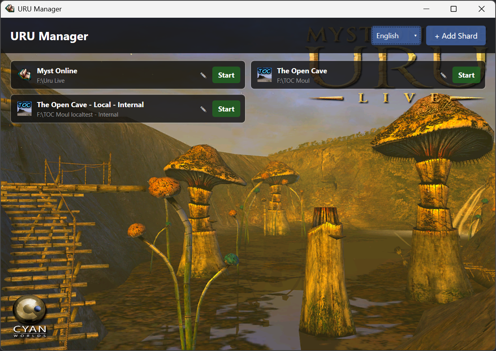

# URU Manager

A universal launcher and manager for [Myst Online: URU Live](https://mystonline.com) shards. Add multiple shards, launch them with one click, and manage everything from a single window.



## Features

- **Multi-shard management** – Add, edit and remove any number of shards
- **One-click launch** – Start `URULauncher.exe` or `plClient.exe` (Internal mode) per shard
- **Custom arguments** – Pass command-line arguments to the launcher
- **Exe icon display** – Automatically loads the icon from the shard's executable
- **Responsive grid** – Tiles reflow automatically as you resize the window
- **Localization** – English and German, switchable at runtime; preference is saved
- **Embedded background** – Background image is bundled inside the executable
- **Persistent config** – Shards are saved to `shards.json` next to the exe

## Requirements

- [.NET Framework 4.8](https://dotnet.microsoft.com/en-us/download/dotnet-framework/net48)

## Build

1. Open `URUManager.sln` in **Visual Studio 2019** or later
2. Select **Debug** or **Release** configuration
3. Press **Ctrl+Shift+B** to build

Output: `bin\Debug\URUManager.exe` or `bin\Release\URUManager.exe`

## Usage

### Adding a shard
1. Click **+ Add Shard** (or **+ Hinzufügen**)
2. Enter a name, the path to the shard folder, and optional arguments
3. Check **Internal** if the shard should be started with `plClient.exe`
4. Click **OK**

### Launching a shard
Click the **Start** button on any shard tile.

### Editing or deleting a shard
Click the **✎** button on a tile to open the edit dialog.  
Use the **Delete** button (bottom left) to remove a shard.

### Changing language
Use the dropdown in the top-right corner to switch between **English** and **Deutsch**.

## File layout

```
URUManager.exe        – Main executable (background image embedded)
shards.json           – Saved shard list (created on first run)
```

Language preference is stored in the Windows Registry under `HKEY_CURRENT_USER\Software\URUManager`.

## License

This project is licensed under the **GNU General Public License v3.0**.  
See [LICENSE](LICENSE.txt) for details.
